# textual的中文入门教程

[TOC]

## 0 前言

Textual是一个用于 Python 的 TUI（文本用户界面）库，是 Rich 的姐妹项目，也依赖于 Rich。它支持 Rich 的 Renderable 类，同时有自己的互动性组件 Widget 类。通过使用简单的 Python API 构建复杂的用户界面，在shell工具或浏览器上运行。

什么是TUI？

之前的《nicegui的中文入门教程》中介绍的nicegui是一个GUI框架、WebUI框架，基于它实现的界面可以运行在桌面和浏览器中，对应的，可以称之为GUI程序、WebUI程序。TUI程序则是运行在用户终端（或者叫命令行）中，以终端支持的显示方式提供的图形化程序，因此TUI可以解释为终端用户界面（Terminal User Interface），而终端能提供的显示方式一般是可打印字符，可以通过特定字符的组合使用，实现GUI中组件的类似效果，因此，TUI也可以被解释为基于文本的用户界面（Text-based User Interface）。

相比于nicegui的框架用法简单，组件用法繁多，textual的框架用法硬核不少，需要了解一些Python之外的Web知识（样式、布局），再加上textual官网不提供中文教程，本教程由此诞生。本教程将基于textual的官网教程，整合官网教程内容，系统性地提供中文版学习教程，方便中文开发者入门使用。

## 1 环境准备

《nicegui的中文入门教程》已经详细介绍了基本环境的准备过程，这里不再赘述，直接说使用的工具和命令。

开发工具选用的是vscode，安装python开发使用的插件。

环境管理工具选用pdm，python版本选用3.12。注意，3.13版本也可以，但为了保证框架稳定运行，推荐使用上一个大版本的python。

为了确保vscode的终端可以正常运行textual程序，使用浏览器访问下面地址，将vscode的该项设置启用，确保终端不会冻结：

```shell
vscode://settings/terminal.integrated.experimental.windowsUseConptyDll
```

基础环境的初始化同样参考《nicegui的中文入门教程》，在初始化完成之后，添加textual、textual-serve、textual-dev三个包，命令如下：

```shell
pdm add textual textual-serve textual-dev
```

其中，textual是框架的主体包，textual-serve是一个让textual程序在网页中运行的扩展包，textual-dev是一个调试textual程序的开发调试工具。扩展包和开发调试工具的用法将在后面介绍，这里只是提前准备好。

如果不使用pdm管理虚拟环境，而是使用全局pip安装，直接调用全局python解释器来开发textual程序，可以使用下面的pip命令安装：

```shell
pip install textual textual-serve textual-dev
```

打开vscode的终端，分别运行`textual`和`python -m textual`，输出以下内容和textual的演示程序，则表示环境没有问题：

```shell
Usage: textual [OPTIONS] COMMAND [ARGS]...

Options:
  --version  Show the version and exit.
  --help     Show this message and exit.

Commands:
  borders   Explore the border styles available in Textual.
  colors    Explore the design system.
  console   Run the Textual Devtools console.
  diagnose  Print information about the Textual environment.
  easing    Explore the animation easing functions available in Textual.
  keys      Show key events.
  run       Run a Textual app.
  serve     Run a local web server to serve the application.
```

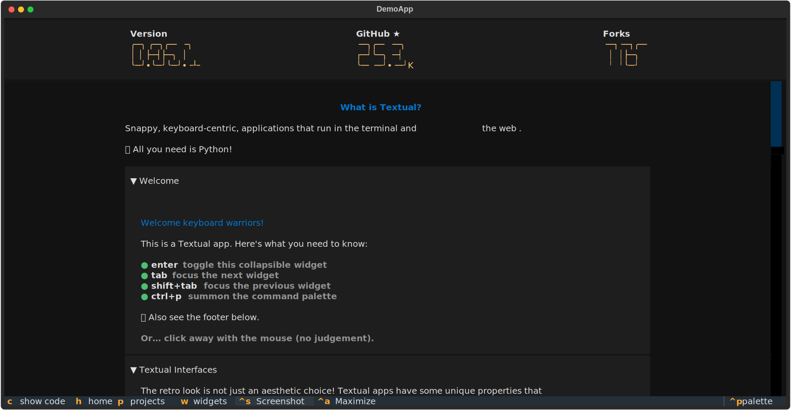

因为textual还在活跃开发中，版本发布比较频繁，可以使用`pdm update textual textual-serve textual-dev`（pdm）或者`pip install -U textual textual-serve textual-dev`（pip）来更新包，确保问题及时修复，可以使用最新的功能。

## 2 入门基础

### 2.1 认识textual

[Textual](https://textual.textualize.io/)，一款颇具Web风格的TUI框架。这是在系统性看完textual这个框架的教程之后，留下的第一印象。

在正式开始textual的学习之前，有必要讲一讲textual的设计哲学。在《nicegui的中文入门教程》中，介绍了图形界面的三个基本概念——控件、布局和交互。但这些对于简陋的TUI来说，想要实现同等的效果，需要付出更多的代码成本。C语言的ncurses太过底层，需要自己完全实现组件、交互。可以使用脚本调用的whiptail，虽然提供了不少组件，但是纯向导式交互，也不支持直接点击操作，用途有限。尽管dialog在whiptail基础上支持点击，但也是‌因循守旧‌，并没有青出于蓝的表现。

因此，textual借助python的易学性，结合了Web中CSS样式的灵活美观，创新性地设计出基于CSS样式设计TUI程序的方式。当然，GUI中的组件和交互也没有落下。只不过受限于终端的表现形式，动画、色彩、布局等表现只能算差强人意，并不能做到媲美。

### 2.2 基础知识

本节主要内容源于官网的[guide页](https://textual.textualize.io/guide/)。

#### 2.2.1 Hello World

正如编程语言的学习始于输出“Hello World!”，先看一下textual程序的“Hello World!”代码是什么样子：

```python3
from textual.app import App
from textual.widgets import Static

class MyApp(App):
    def compose(self):
        yield Static('Hello World!')

if __name__ == '__main__':
    app = MyApp()
    app.run()
```

将代码保存为`myapp.py`或者任意`.py`后缀的文件，点击运行或者在终端中使用`python myapp.py`命令运行，可以看到终端显示下面的内容：

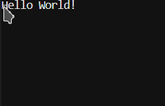

上面的代码可以在终端输出一句话，只不过，这句话不同于直接在终端回显的文字，这句话是显示在textual程序中的静态文本。

如果需要退出的话，按下`ctrl`+`c`，即可退出。

需要注意的是，因为pdm初始化项目会产生`src\{项目名}`目录，标准操作是将源代码放到该目录下，而vscode的打开终端只是到项目根目录，通过命令行运行的话，需要cd到`src\{项目名}`目录，即源代码文件的同级目录，后续的命令行操作之前皆需要执行此操作，就不再赘述，读者实操之前请不要忘了这一步。

相比于nicegui最短三行的“Hello World!”，textual的代码显得臃肿不少，结构上也复杂得多。不过不用担心，这里只是简单看一下textual程序的代码和运行效果，不需要细究每一行代码的作用，在学习textual代码的作用之前，还需要学习一些代码之外的知识。

#### 2.2.2 开发者工具

前面环境准备中安装了textual-dev之后，可以在终端执行`textual`得到一系列输出，此工具就是本节要介绍的开发者工具，完整介绍可以参考[官网文档](https://textual.textualize.io/guide/devtools/)。

##### 2.2.2.1 run命令

运行textual程序有千百种姿势，前面介绍了textual程序的“Hello World!”代码，采用的运行方式是直接运行，本质上就是`python main.py`这种直接运行python源代码文件的常规方法。但是，textual的开发者工具`textual`的run命令也可以运行textual程序。

最常规的方法：

```shell
textual run myapp.py
```

此方法等同于`python myapp.py`，后面直接跟可运行的python源代码文件。

run命令还支持运行模块中的textual类或者实例。想要测试这种运行方法的话，需要对前面的textual程序的“Hello World!”代码做一点小小的改动。

改动后的代码如下：

```python3
from textual.app import App
from textual.widgets import Static

class MyApp(App):
    def compose(self):
        yield Static('Hello World!')

app = MyApp()
```

改动后的代码将`app = MyApp()`移动到最左端的缩进，同时去掉了对`__name__ == "__main__"`的判断和`app.run()`，这就意味着，该python源代码文件在当作模块导入（`from . import myapp`）时，不会运行`app.run()`，同时可以导入`app`和`MyApp`这两个模块的成员。

接下来，新建文件夹test，将myapp.py放到test文件夹，并在文件夹中创建空白的\_\_init\_\_.py文件，用于表明test是个包。那么，将得到以下文件结构：

```shell
test
├─__init__.py
└─myapp.py
```

执行以下命令，将看到熟悉的输出：

```shell
textual run test.myapp
```


聪明的读者肯定想到，前面的myapp.py既可以直接运行，也可以当做模块导入。这里很复杂的操作只为构建一个包，如果不做包，直接执行模块文件，行不行？

当然可以，假如当前目录下的myapp.py是前面改动后的代码，下面的命令可以运行单文件模块：

```shell
textual run myapp
```

不过很可惜，上面的命令并不能成功，它只得到以下输出：

```shell
Unable to import 'app' from module 'myapp'
```

因为当前目录下的myapp.py是最开始的textual程序的“Hello World!”代码，当做模块导入的话，没有`app`这个成员，只有`MyApp`这个成员，因此默认不能执行。想要成功执行的话，要么像上面的改动一样，添加`app = MyApp()`到最左端的缩进，要么就用下面的命令指定App的继承类来执行：

```shell
textual run myapp:MyApp
```

然后，就能看到熟悉的输出：


当然，上面费劲构建出来的包也支持指定继承类来执行：

```shell
textual run test.myapp:MyApp
```

run命令还支持一些额外的选项，进而解锁textual程序的其他能力。

run命令加上`--dev`选项，可以开启调试模式，能让textual程序的样式修改可以实时生效，也能将textual程序的终端输出和日志消息输出到console（提前在另一个终端中运行`textual console`可以开启console界面）中。关于样式和console，后面会介绍到，这里只需记住`--dev`选项是一个方便的调试选项即可。示例如下：

```shell
textual run --dev myapp.py
```

run命令还支持`-c`选项，与python的`-c`选项可以执行python代码字符串类似，此选项后可以跟任意可通过“运行”执行的命令，比如notepad。字符串或者直接裸命令都可以。示例如下：

```shell
textual run -c notepad
textual run -c 'notepad'
```

当然，使用`-c`选项也可以执行运行textual程序的命令，不过，嵌套在run命令下执行原本可以运行textual程序的命令，就有点多此一举。示例如下：

```shell
textual run -c python myapp.py
```

注意，某些命令（如“dir”、“ls”）不是可以通过“运行”执行的可执行文件，而是终端或者shell提供的内建命令，则无法使用`-c`选项执行。

此外，部分命令（如“python”、“textual”）也支持`-c`选项的话，不能重复添加`-c`选项到裸命令后来让被执行的命令接收，只能使用字符串的形式间接让被执行的命令接收。比如：

```shell
textual run -c python -c "print('abc')"
# 上面的命令会报错，被执行命令的-c选项会被textual接收，进而把print('abc')传递给终端
# 可以把被执行命令的-c选项连同被执行命令，一起放到字符串内，如下面所示
textual run -c 'python -c "print(''abc'')" '
```

至此，在终端运行textual程序的所有方法都解锁完毕，最后用一个表格总结一下run命令的用法：

| 命令行示例                                                   | 运行目标                                                     | 命令说明                                                     |
| ------------------------------------------------------------ | ------------------------------------------------------------ | ------------------------------------------------------------ |
| `textual run myapp.py`                                       | python源代码                                                 | 和`python myapp.py`一样                                      |
| `textual run myapp`<br>`textual run test.myapp`              | 包的模块文件或者单模块文件的app成员                          | app必须是App（来自textual.app）的子类的实例<br>并且在可以从模块中导出 |
| `textual run myapp:MyApp`<br/>`textual run test.myapp:MyApp` | 包的模块文件或者单模块文件的指定类                           | 指定的类必须是App（来自textual.app）的子类<br/>并且在可以从模块中导出 |
| `textual run --dev myapp.py`<br>`textual run --dev myapp`    | python源代码<br>包的模块文件或者单模块文件的app成员<br>包的模块文件或者单模块文件的指定类 | 开启调试模式<br>样式修改可以实时生效<br>终端输出和日志消息会输出到console |
| `textual run -c notepad`<br/>`textual run -c 'notepad'`<br>`textual run -c python myapp.py`<br>`textual run -c 'python -c "print(''abc'')" '` | 可在终端运行的可执行程序名<br>基于上一目标添加的、不包括-c/--dev的选项和参数<br>使用字符串表示的上面两种目标 | 如果想给被运行的命令传入-c/--dev选项<br>必须用字符串表示运行目标 |

run命令支持的参数和用法还有很多，不过在前期基础学习阶段用不上，这里就不引入了。等到后面需要使用时再扩展这部分内容。

##### 2.2.2.2 serve命令

前言中介绍过，textual程序可以在浏览器中运行，这话并不是说textual是一个WebUI框架。起码从它在浏览器中运行的表现来看，textual不同于常规的WebUI框架。textual程序在浏览器中运行，更像是在浏览器中模拟出一个终端，让程序在正常终端中的输出，全部在浏览器中原样呈现。

环境准备中提到，textual-serve是一个让textual程序在网页中运行的扩展包，后续可以基于此扩展包，编写出将普通textual程序转化为网页的python脚本。在正式学习textual-serve之前，读者可以使用textual的serve命令，快捷运行textual程序，让其呈现在浏览器中。

以下面的命令为例：

```shell
textual serve myapp.py
```

执行命令之后，可以看到终端有如下输出：

```shelll
___ ____ _  _ ___ _  _ ____ _       ____ ____ ____ _  _ ____ 
 |  |___  \/   |  |  | |__| |    __ [__  |___ |__/ |  | |___ 
 |  |___ _/\_  |  |__| |  | |___    ___] |___ |  \  \/  |___ v1.1.1

Serving 'python myapp.py' on http://localhost:8000

Press Ctrl+C to quit
```

在浏览器中访问`http://localhost:8000`，即可看到网页运行的效果：

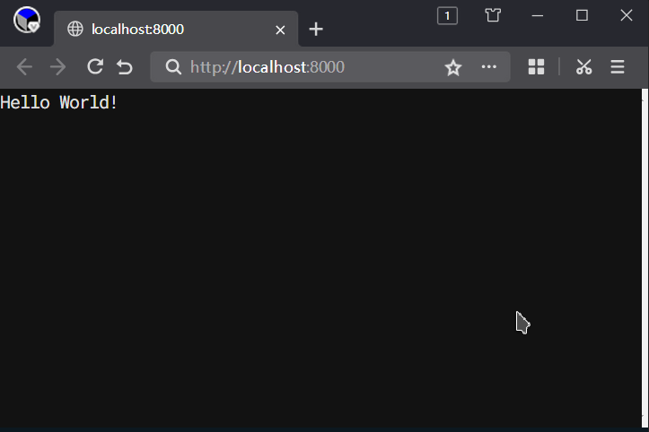

serve命令不仅支持所有run命令的格式，还比run命令支持更多功能。

首先，serve命令默认支持等同于`-c`选项的参数。尽管serve命令可以通过添加`-c`选项实现和run命令一样的效果，但serve命令依旧可以不使用该选项的情况下，直接支持`-c`选项的参数。比如，上面的示例就可以变成下面这种格式：

```shell
textual serve python myapp.py
```

需要特别注意的是，serve命令本质上是将textual程序在终端的输出传递给textual-serve扩展包，让其在浏览器中显示。因此，serve命令运行`-c`选项的参数必须输出的是textual程序，这一点与run命令不同：

```shell
textual serve 'python myapp.py'
```

serve命令支持的参数和用法还有很多，不过在前期基础学习阶段用不上，这里就不引入了。等到后面需要使用时再扩展这部分内容。

#### 2.2.3 textual程序的基本概念

前面讲了一堆textual程序之外的命令，这一节重点讲一下textual程序本身。

##### 2.2.3.1 App类

以下面的代码为例，了解一下textual程序的基本结构：

```python3
from textual.app import App
from textual.widgets import Static

class MyApp(App):
    def compose(self):
        yield Static('Hello World!')

if __name__ == '__main__':
    app = MyApp()
    app.run()
```

textual.app中的App类，是一个预先定义好的模板类，开发者可以通过继承此类，快速实现一个可以实例化的标准textual程序中的App子类。一般来说，textual程序，就是调用App类或者其子类的实例的run方法，来让消息循环占据终端的输入输出，显示出预先设计的界面。因此，代码中必须要有类的实例化和调用run方法的过程。当然，如果是采用其他方法运行，比如`textual run myapp`或者`textual run myapp:MyApp`，textual命令会自动寻找模块中名为`app`的实例来调用其run方法，或者基于提供的子类类名，自动完成实例化和调用run方法的过程。

代码中的`__name__ == "__main__"`条件判断，是针对该文件不是当做模块调用，而是直接运行时的选择，因为`app.run()`在导入时被运行的话，会导致程序进入textual的消息循环，无法正常导入其成员。当然，导入一般是导入类或者方法，`app = MyApp()`这句是实例化一个对象，一般不会当做导入的成员，自然需要放到判断分支内。

关于App类，还有两点需要补充，以下面的代码为例：

```python3
from textual.app import App
from textual.widgets import Static

class MyApp(App):
    def __init__(self,*args,**kwargs):
        super().__init__(*args,**kwargs)
        self.ansi_color = False
    def compose(self):
        yield Static('Hello World!')

if __name__ == '__main__':
    app = MyApp()
    app.run(inline=False)
```

代码中，在初始化方法中设置了一个属性`ansi_color`的值为`False`（默认值），在run方法中设置了一个参数`inline`的值为`False`（默认值）。

其中，ansi_color表示textual程序是否启用终端的ansi颜色的转义序列。表示的是，如果终端支持颜色主题切换，textual程序的默认颜色就会随终端主题走，而不是替换为textual自己设定的默认颜色。此颜色仅指没有经过样式、主题指定的显示颜色，如果颜色被指定，则不受影响。

`ansi_color`的值为`False`时终端的显示效果：

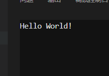

`ansi_color`的值为`True`时终端的显示效果：

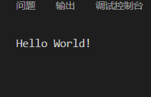

可以看到，当启用ansi颜色，原本与终端背景颜色略有区别的黑色，变成了与终端背景一样的黑色。

inline参数表示是否启用textual程序的行内模式。一般的，此参数不设置为`True`的话，textual程序会以应用模式运行，textual程序的界面会占据终端全部的显示区域。如果此参数设置为`True`，则textual程序会以行内模式运行，程序界面显示为固定大小，甚至能看到程序上面显示着之前输入的命令。

注意，行内模式目前不支持在Windows的终端，下面的演示截图来自Linux的终端。

还是上面提供的代码，在只修改inline参数为`True`的情况下，效果如图：

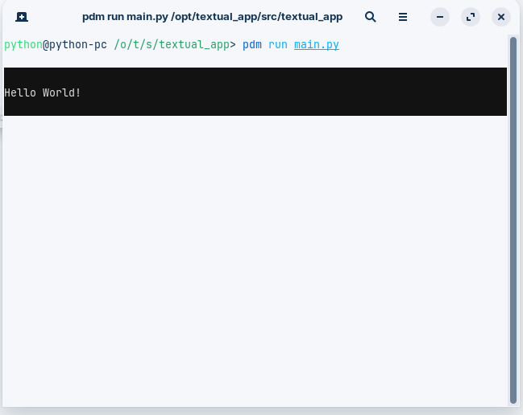

##### 2.2.3.2 事件

textual有一套自己的事件响应系统（[官网文档](https://textual.textualize.io/events/)），它可以响应键盘按键、鼠标按键、组件状态变化等事件。事件的响应方法是一系列以`on_`为前缀的方法，比如下面代码中的`on_mount`和`on_key`，就是响应程序加载和键盘按键的方法。

```python3
from textual.app import App
from textual import events

class EventApp(App):
    COLORS = [
        'white',
        'maroon',
        'red',
        'purple',
        'fuchsia',
        'olive',
        'yellow',
        'navy',
        'teal',
        'aqua',
    ]
    def on_mount(self) -> None:
        self.screen.styles.background = 'darkblue'
    def on_key(self, event: events.Key) -> None:
        if event.key.isdecimal():
            self.screen.styles.background = self.COLORS[int(event.key)]

if __name__ == '__main__':
    app = EventApp()
    app.run()
```

运行上面代码，可以看到终端显示如下：

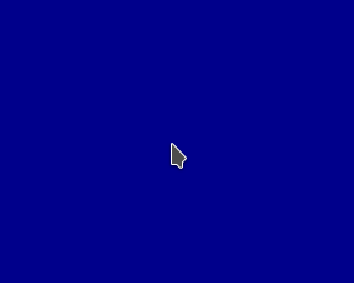

这是因为响应程序加载的`on_mount`方法中，将`self.screen.styles.background`（主屏幕背景色）设置为"darkblue"，表示程序加载完成时的背景色。如果按下数字键0-9中的任意数字，可以看到背景色会随着按键的按下而变化。这是因为响应键盘按键的`on_key`方法中，会基于事件中按键的值，到`COLORS`这个预先定义了一系列颜色名字的列表中取值，赋给`self.screen.styles.background`（主屏幕背景色），让背景颜色随之变化。

当然，读者并不需要细究到底有多少事件响应方法，也不需要细究背景色支持哪些名字，只需要记住`on_`为前缀的方法是textual的事件响应方法。至于具体用法，将会在后面用到时细讲，同时也可以查阅官网文档手册，这里只是介绍一下事件系统。

##### 2.2.3.3 组件

组件，在其他UI框架中也可以称之为控件，是用户界面上重要的组成部分。组件是一个或者一组预先定义好的内容，可以在终端中（在textual中称之为当前屏幕）显示出来，用来构成用户界面。和其他UI框架中的控件类似，textual的组件包括静态文本（之前代码中的Static）、按钮、输入框等官方实现的组件，方便开发者组合定义自己想要的组件。

想必聪明的读者在学习前面的代码时已经注意到，MyApp类中除了介绍过的`on_`开头的事件响应方法，还包含着一个名为`compose`的方法，需要显示的静态文本就放在这个方法内。

没错，不同于其他框架（比如之前学习的nicegui）调用控件代码就会直接显示控件，textual显示控件的方法，有点类似使用布局定义好控件之后，统一调用显示方法来显示控件。在textual中，这个统一的显示方法，就是App子类中的compose方法。在compose方法中，使用`yield`关键字（类似`return`）返回要显示的组件，使compose方法变成一个生成器，textual框架就会将compose方法中返回的组件显示到终端中。不同于`return`只能返回一次，多次使用`yield`可以返回多个组件，这样的话，终端上可以显示多个组件。

在compose方法中定义需要显示的组件是简单好用的方法，一般推荐读者这样操作。但是，在此方法中显示组件是随着textual程序运行一同进行的，如果需要在执行交互之后才显示组件，那就要用到App类的mount方法。调用此方法，并给此方法传入组件，即可在需要的时候显示组件。

以下面的代码为例，对比一下两种显示组件的方法。代码中，compose方法使用了两次yield，使得终端里可以显示两个静态文本。因为这里没有设置控件的布局，因此第二个静态文本“Please input:”是以终端默认的显示方式——换行，显示在第一个静态文本之后。

在on_key方法中，当按键为数字键时，通过调用`self.mount`，并传入静态文本控件，可以实现基于按键操作显示新的静态文本。

代码和效果图如下：

```python3
from textual.app import App
from textual.widgets import Static

class MyApp(App):
    def compose(self):
        yield Static('Hello World!')
        yield Static('Please input:')
    def on_key(self, event):
        if event.key.isdecimal():
            self.mount( Static(f'Hello {event.key}!') )

if __name__ == '__main__':
    app = MyApp()
    app.run()
```

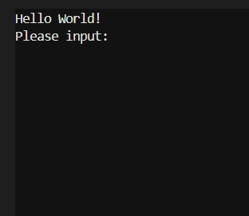

##### 2.2.3.4 退出

退出程序的方法，不止`ctrl`+`c`。

一开始介绍textual的代码时，只说了退出程序使用组合键`ctrl`+`c`。其实，这样说没错，一般运行终端命令，想要强制结束程序的时候，就是使用这个组合键。但是，如果细细思考，这个说法似乎有问题。组合键是强制结束时候使用，正常结束的话，有没有编程执行的结束方法？总不能模拟组合键吧？如果想要添加个退出按钮呢？该如何让按钮执行退出操作？

上面几个问题的答案，就在下面的代码中。当然，代码中涉及到后面才会讲到的知识点，这里不会细讲，本节只讲`self.exit()`这种退出方法。如果读者有兴趣并且学有余力，可以自行对照官网文档学习。若是读者不着急，可以期待后面相关的章节中，再次回顾这里的代码，那时会细讲一次。

```python3
from textual.app import App
from textual.widgets import Static,Button

class MyApp(App):
    def compose(self):
        yield Static('Hello World!')
        yield Static('Press q or click buttons to quit:')
        yield Button('Exit',action='app.exit_app()')
        yield Button('Quit',action='app.quit()')
    def on_key(self, event):
        if event.key == 'q':
            self.exit()
    def action_exit_app(self):
        self.exit()

if __name__ == '__main__':
    app = MyApp()
    app.run()
```

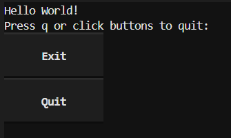

代码实现了三种退出程序的方法，其中，使用点击按钮的方法是后面的知识点，这里仅供读者体验，不要求掌握，暂时也不细讲。此外，还有一种方法，就是结合前面讲过的事件，在响应按键的方法中，通过识别当前按键是不是`q`键，来决定是否执行`self.exit()`。其中，self就是后面实例化的App子类，也就是子类的实例。该实例有名为exit的方法，调用此方法就可以退出textual程序。

##### 2.2.3.5 CSS

前面提到过textual支持CSS样式，可教程直到现在，用于演示的代码既没有布局设计，也没有一点CSS美化的痕迹，不写一个相关示例来展示一下，读者恐怕要失去对textual的兴趣了。

别急，示例这就来了。虽然textual的CSS样式不是标准Web的CSS，但是语法类似，如果有nicegui入门教程的基础，哪怕直接上手textual的CSS，也没什么难度。

就以上一节的代码为例，通过设置CSS样式，让界面变得好看一些。

以下是程序要用的CSS样式代码。在上面的`myapp.py`文件同目录下创建`myapp.tcss`，将代码存到文件中。

```css
Screen {
    layout: grid;
    grid-size: 2;
    grid-gutter: 2;
    padding: 2;
}
Static {
    width: 100%;
    height: 100%;
    column-span: 2;
    content-align: center bottom;
    text-style: bold;
}
Button {
    width: 100%;
}
```

将`myapp.py`文件内容修改如下，主要是添加`CSS_PATH = 'myapp.tcss'`。

```python3
from textual.app import App
from textual.widgets import Static,Button

class MyApp(App):
    CSS_PATH = 'myapp.tcss'
    def compose(self):
        yield Static('Hello World!')
        yield Static('Press q or click buttons to quit:')
        yield Button('Exit',action='app.exit_app()')
        yield Button('Quit',action='app.quit()')
    def on_key(self, event):
        if event.key == 'q':
            self.exit()
    def action_exit_app(self):
        self.exit()

if __name__ == '__main__':
    app = MyApp()
    app.run()
```

运行代码，即可看到效果如图：

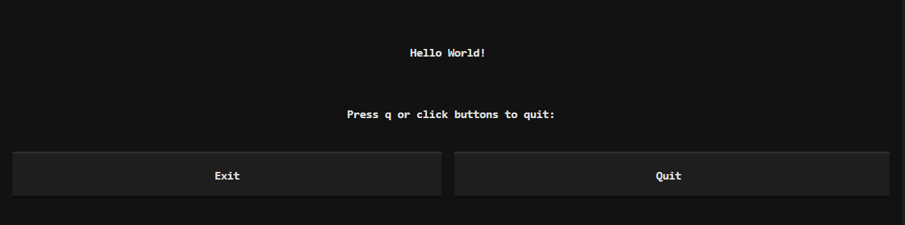

给类设置`CSS_PATH`的值为tcss文件的路径，即可给该App子类的组件设置样式。具体的样式用法会在后面的样式章节专门讲，这里只是介绍一下应用样式的方法。值得注意的是，这里的样式文件使用tcss为扩展名，并不是说一定要用这个扩展名才行。这里是为了与Web中的CSS文件区分，不使用常规的css为扩展名，而是采用了含义为textual css的tcss。当然，如果读者有其他偏好，使用其他扩展名也可以。不过，如果想要使用官方提供的[CSS语法高亮扩展](https://marketplace.visualstudio.com/items?itemName=Textualize.textual-syntax-highlighter)，最好使用tcss后缀，否则只能手动选择语法高亮方案为TextualCSS。vscode用户可以安装此扩展，在打开tcss文件之后看到对应的语法高亮。

采用单独文件保存样式的话，如果是用调试模式运行程序，在样式文件中修改样式，修改效果会实时显示到终端中。

如果不太喜欢这种将样式放到单独文件中的形式，可以参考下面的代码，给类设置`CSS`的值为完整的样式内容，即可将样式嵌入到python源代码中。

需要注意的是，为了样式美观，代码中的样式采用缩进形式换行，因此使用的是三引号的多行文本。在实际使用过程中，样式可以去掉换行，成为一行内容，那就可以只用单引号的字符串。

另外，将样式嵌入到python源代码中，会使样式实时显示修改的功能失效，这也算有得有失吧。

```python3
from textual.app import App
from textual.widgets import Static,Button

class MyApp(App):
    CSS = '''
    Screen {
        layout: grid;
        grid-size: 2;
        grid-gutter: 2;
        padding: 2;
    }
    Static {
        width: 100%;
        height: 100%;
        column-span: 2;
        content-align: center bottom;
        text-style: bold;
    }
    Button {
        width: 100%;
    }
    '''
    def compose(self):
        yield Static('Hello World!')
        yield Static('Press q or click buttons to quit:')
        yield Button('Exit',action='app.exit_app()')
        yield Button('Quit',action='app.quit()')
    def on_key(self, event):
        if event.key == 'q':
            self.exit()
    def action_exit_app(self):
        self.exit()

if __name__ == '__main__':
    app = MyApp()
    app.run()
```

##### 2.2.3.6 标题与副标题

textual的类除了`CSS_PATH`和`CSS`这两个设置样式的属性之外，还有`TITLE`和`SUB_TITLE`这两个属性，分别表示程序的标题和副标题。为了显示标题和副标题，需要添加Header标题栏。代码如下：

```python3
from textual.app import App
from textual.widgets import Static,Button,Header

class MyApp(App):
    TITLE = 'MyApp'
    SUB_TITLE = 'Best App'
    def compose(self):
        yield Header()
        yield Static('Hello World!')

if __name__ == '__main__':
    app = MyApp()
    app.run()
```

显示效果如图：

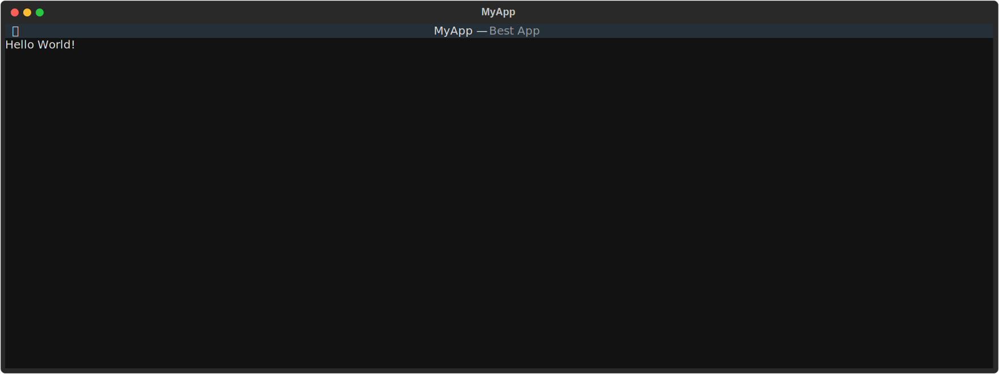

当然，这两个是类属性，如果想在创建实例之后动态修改，就不能使用这两个纯大写的属性，而是使用纯小写的属性代替。参考下面的代码，代码中没有在类中设置标题和副标题，而是在App子类实例化之后，使用实例的属性设置标题和副标题，这样得到的显示效果和上图一样。此外，此操作方法也可用于事件的响应代码中，实现动态修改标题和副标题。在代码中，通过判断按键是数字还是字母，来将标题修改为数字，将副标题修改为字母。

```python3
from textual.app import App
from textual.widgets import Static,Button,Header

class MyApp(App):
    def compose(self):
        yield Header()
        yield Static('Hello World!')
    def on_key(self, event):
        if event.key.isdecimal():
            self.title = event.key
        if event.key.isalpha():
            self.sub_title = event.key

if __name__ == '__main__':
    app = MyApp()
    app.title = 'MyApp'
    app.sub_title = 'Best App'
    app.run()
```

#### 2.2.4 样式

##### 2.2.4.1 样式接口

上一节中，介绍了textual程序的基本组成和用法，那些是后续开发中常用的功能。其中，CSS这一节还介绍了加载CSS文件样式的两种方法。不过，在正式学习textual的CSS语法之前，还有必要介绍一个应用样式的接口。相比于记住语法规则和编写完整的CSS文件，直接使用组件的接口设置组件的样式，更简单快捷。

组件有一个名为`styles`的属性，该属性代表组件的样式接口。通过调用此属性下的子属性，可以快速设置对应属性代表的样式。

下面的代码展示了如何使用此接口设置screen（一个代表当前屏幕的特殊组件，屏幕的用法和更多知识后面会细讲）和普通组件静态文本的样式，修改它们的颜色和其他样式。

```python3
from textual.app import App
from textual.widgets import Static

class MyApp(App):
    def compose(self):
        text = Static('Hello World!')
        text.styles.color = 'red'
        yield text
    def on_mount(self):
        self.screen.styles.background = 'darkblue'
        self.screen.styles.border = ('heavy', 'white')

if __name__ == '__main__':
    app = MyApp()
    app.run()
```

效果如图：

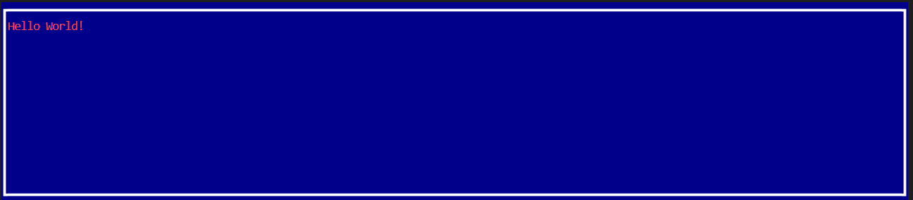

代码中，`text.styles.color = 'red'`是设置静态文本的颜色为红色，对于文本而言，颜色（更多用法参考[官网文档](https://textual.textualize.io/styles/color/)）就是指文字的颜色，如果是其他具有前景颜色属性的组件，则颜色表示前景色。`self.screen.styles.background = 'darkblue'`是把当前屏幕的背景色（更多用法参考[官网文档](https://textual.textualize.io/styles/background/)）设置为深蓝色。对于屏幕而言，其前景色表示显示在上面的、没有指定颜色的文本的颜色，而上面的静态文本已经指定颜色，这里指定颜色的优先级比上面的指定低，因此这里是设置了背景色来表明效果。此外，`self.screen.styles.border = ('heavy', 'white')`还设定了当前屏幕的边框粗细和边框颜色（更多用法参考[官网文档](https://textual.textualize.io/styles/border/)，或者看后面详细讲解的内容）。

##### 2.2.4.2 颜色

相信读者已经注意到一点，上面代码中用到的颜色都是含义通俗易懂的字符串，而不是使用十六进制数字或者三元组数字等量化表示颜色的方法。其实，textual支持那些有点神秘的数字表示法，只是为了更易懂一些，代码中特地使用了textual预先定义好的颜色名字。具体名字可以参考[官网文档](https://textual.textualize.io/api/color/#textual.color--named-colors)或者下图：

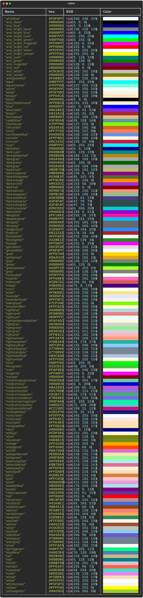

至于量化表示颜色的方法，textual支持这几种表示方法：

-   RGB颜色，以`#`开头，六位十六进制数字，每两位代表一种颜色的分量值，依次代表红色、绿色、蓝色，例如`#ff0000`（红色）。对于代表颜色分量的两位数字一样的情况，可以简写为一位数字，那原来`#`后的六位数字就可以变成三位数字，例如前面表示红色的示例可以写成`#f00`。
-   RGB颜色，以`rgb`开头，形式类似调用函数（用来表示的字符串不能含空格，否则会报错），有三个参数，都是十进制数字（也就是上一种表达方式中的十六进制数字对应的十进制值），分别是代表红色、绿色、蓝色，例如`rgb(255,0,0)`
-   HSL颜色，以`hsl`开头，形式类似调用函数（用来表示的字符串不能含空格，否则会报错），有三个参数，分别是色相、饱和度、亮度。其中，色相是取值0-360的角度，饱和度和亮度是取值0%-100%的百分比，例如`hsl(0,100%,50%)`（红色）。

除了上面的颜色表达方式，`color`属性和`background`属性还接受Color对象作为动态的颜色。Color对象支持的方法和更多用法可以参考[官网文档](https://textual.textualize.io/api/color/)，这里只简单介绍一下需要用的方法。

想要使用Color对象，需要从textual.color模块中导入。使用`from textual.color import Color`导入之后，就和前面介绍的第二种RGB颜色表达方法一样，Color对象的实例化需要三个对应的十进制参数。

下面的代码中，使用了上面提到的五种颜色表示方法，来将静态文本的背景颜色设置为红色：

```python3
from textual.app import App
from textual.widgets import Static
from textual.color import Color

class MyApp(App):
    def compose(self):
        text = [Static('Hello World!') for _ in range(5)]
        text[0].styles.background = 'red' 
        text[1].styles.background = '#ff0000' # 或者#f00
        text[2].styles.background = 'rgb(255,0,0)'
        text[3].styles.background = 'hsl(0,100%,50%)'
        text[4].styles.background = Color(255,0,0)
        for i in text:
            yield i

if __name__ == '__main__':
    app = MyApp()
    app.run()
```

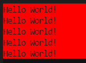

在颜色的表达方式中，除了上面提到的几种分量之外，textual还支持另一个分量——透明度Alpha。改变颜色透明度，可以让当前颜色与其下面的颜色混合，如组件的前景和背景或者组件的背景与另一组件的背景。透明度的范围是0%到100%，0%表示该颜色完全没有，即完全透明，100%表示该颜色完全不透明， 即显示该颜色原本的样子。

textual支持三种设置颜色透明度的方式：

-   在表达颜色的字符串中，以空格分隔的形式添加百分比表示的透明度值，例如`'red 20%'`。此方法支持通俗的颜色名称和量化表达。
-   在构建Color对象时，传入与百分数等值的小数给参数`a`，例如`Color(255,0,0,a=0.2)`。
-   使用Color.parse方法，将包含透明度的量化颜色（RGBA颜色和HSLA颜色）表达转换为Color对象，例如`Color.parse('#ff000033')`。

关于包含透明度的量化颜色方法，textual支持这几种：

-   RGBA颜色，以`#`开头，八位十六进制数字，每两位代表一种颜色的分量值，依次代表红色、绿色、蓝色、透明度，例如`#ff000033`（红色，20%透明度）。对于代表颜色分量的两位数字一样的情况，可以简写为一位数字，那原来`#`后的八位数字就可以变成四位数字，例如前面表示红色的示例可以写成`#f003`。
-   RGBA颜色，以`rgba`开头，形式类似调用函数（用来表示的字符串不能含空格，否则会报错），有四个参数，都是十进制数字（也就是上一种表达方式中的十六进制数字对应的十进制值），最后一个是小数，分别是代表红色、绿色、蓝色、透明度，例如`rgb(255,0,0,0.2)`
-   HSLA颜色，以`hsla`开头，形式类似调用函数（用来表示的字符串不能含空格，否则会报错），有四个参数，分别是色相、饱和度、亮度、透明度。其中，色相是取值0-360的角度，饱和度和亮度是取值0%-100%的百分比，透明度是小数，例如`hsl(0,100%,50%,0.2)`（红色，20%透明度）。

下面的代码中，使用了上面提到的三种设置透明度的形式，共七个示例，来将静态文本的背景颜色设置为20%透明度红色：

```python3
from textual.app import App
from textual.widgets import Static
from textual.color import Color

class MyApp(App):
    def compose(self):
        text = [Static('Hello World!') for _ in range(7)]
        text[0].styles.background = 'red 20%' # 常规颜色表达加空格，后接表示透明度的百分数
        text[1].styles.background = 'rgb(255,0,0) 20%' # 使用量化的颜色表达也可以
        text[2].styles.background = Color(255,0,0,a=0.2) # 可以在构建Color对象时传入Alpha的值
        text[3].styles.background = Color.parse('#ff000033') # 也可以使用Color.parse解析含透明度的颜色表达，rgba或者hsla
        text[4].styles.background = Color.parse('#f003') # #开头的rgba表达同样支持长度变成一半的短格式，等同于#ff000033
        text[5].styles.background = Color.parse('rgba(255,0,0,0.2)') # 类似函数调用的表达，第四个参数是Alpha值，是小数而不是百分数
        text[6].styles.background = Color.parse('hsla(0,100%,50%,0.2)') # 对于hsla来说，Alpha值一样是小数，不要和前面的百分数混淆
        for i in text:
            yield i

if __name__ == '__main__':
    app = MyApp()
    app.run()
```

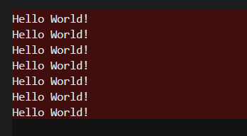

##### 2.2.4.3 盒子模型

如果有CSS基础的话，就能轻易想象到CSS中的盒子模型。没有基础也没关系，这里会再讲一遍。

textual组件通常占据一个矩形区域，就像一个盒子一样。这个盒子最小可以到一个字符大小，最大可以到整个屏幕。当然，如果样式中启用了[滚动](https://textual.textualize.io/styles/overflow/)，还能更大。

对于组件这个盒子而言，以下几种相关的样式会影响到组件的大小表现：

-   [宽度（width）](https://textual.textualize.io/styles/width/)和[高度（height）](https://textual.textualize.io/styles/height/)决定了组件的显示大小。
-   [内边距（padding）](https://textual.textualize.io/styles/padding/)决定了组件内包含的内容（如文字或者其他组件）到组件可视边界的距离。
-   [边框（border）](https://textual.textualize.io/styles/border/)则让组件的可视边界变得突出，边框可以设置样式和粗细，内边距则是在边框粗细的基础上计算距离。

其实，除了上面几个与组件显著相关的尺寸样式之外，[外边距（margin）](https://textual.textualize.io/styles/margin/)也是属于组件的尺寸样式，只不过外边距不会影响组件的大小和内容表现，只会在与其他组件一起参与布局时，表现为其他组件距离组件可视边界的远近。

具体几个尺寸样式的关系，下图表现得很直观：

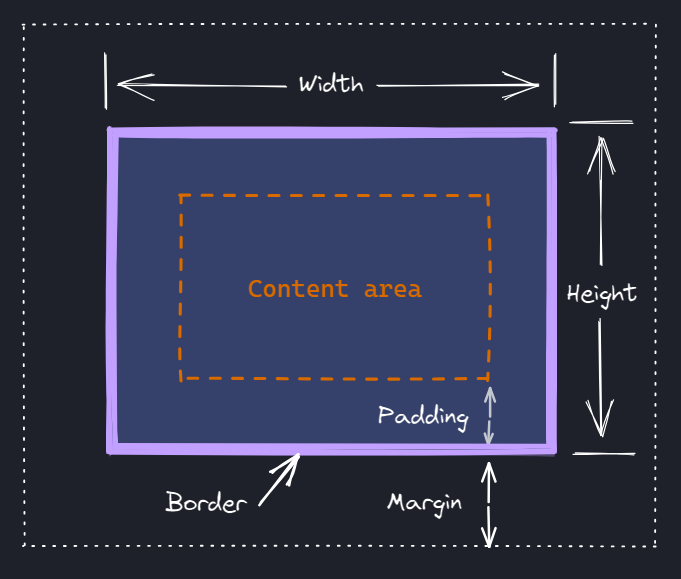

##### 2.2.4.4 宽度、高度和比例单位

设置组件的宽度（width）会限制组件的所使用的列数，设置组件的高度（height）会限制组件的所使用的行数。以下面的代码为例，在设置了宽度为30、高度为10之后（紫色区域的大小即组件的宽度和高度），原本多行的内容会被限制在很小的区域内，宽度小于内容宽度会导致内容换行，高度小于内容高度会导致超过指定高度的内容被裁剪，不会完整显示。

```python3
from textual.app import App
from textual.widgets import Static

TEXT = '''The Zen of Python, by Tim Peters

Beautiful is better than ugly.
Explicit is better than implicit.
Simple is better than complex.
Complex is better than complicated.
Flat is better than nested.
Sparse is better than dense.
Readability counts.
Special cases aren't special enough to break the rules.
Although practicality beats purity.
Errors should never pass silently.
Unless explicitly silenced.
In the face of ambiguity, refuse the temptation to guess.
There should be one-- and preferably only one --obvious way to do it.
Although that way may not be obvious at first unless you're Dutch.
Now is better than never.
Although never is often better than *right* now.
If the implementation is hard to explain, it's a bad idea.
If the implementation is easy to explain, it may be a good idea.
Namespaces are one honking great idea -- let's do more of those!'''


class MyApp(App):
    def compose(self):
        self.widget = Static(TEXT)
        yield self.widget

    def on_mount(self) -> None:
        self.widget.styles.background = 'purple'
        self.widget.styles.width = 30
        self.widget.styles.height = 10

if __name__ == '__main__':
    app = MyApp()
    app.run()
```

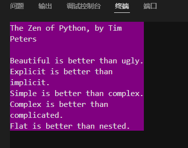

但是，更多时候需要设置组件的宽度为固定值，而让高度随内容变化。这时，可以设置高度为`'auto'`，这样的话，高度就会基于内容多少而变化，始终确保全部内容显示出来，代码如下：

```python3
from textual.app import App
from textual.widgets import Static

TEXT = '''The Zen of Python, by Tim Peters

Beautiful is better than ugly.
Explicit is better than implicit.
Simple is better than complex.
Complex is better than complicated.
Flat is better than nested.
Sparse is better than dense.
Readability counts.
Special cases aren't special enough to break the rules.
Although practicality beats purity.
Errors should never pass silently.
Unless explicitly silenced.
In the face of ambiguity, refuse the temptation to guess.
There should be one-- and preferably only one --obvious way to do it.
Although that way may not be obvious at first unless you're Dutch.
Now is better than never.
Although never is often better than *right* now.
If the implementation is hard to explain, it's a bad idea.
If the implementation is easy to explain, it may be a good idea.
Namespaces are one honking great idea -- let's do more of those!'''


class MyApp(App):
    def compose(self):
        self.widget = Static(TEXT)
        yield self.widget

    def on_mount(self) -> None:
        self.widget.styles.background = 'purple'
        self.widget.styles.width = 30
        self.widget.styles.height = 'auto'

if __name__ == '__main__':
    app = MyApp()
    app.run()
```

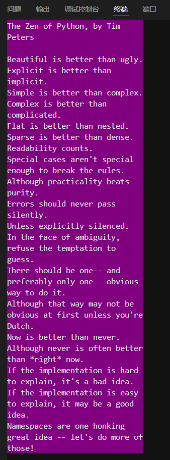

除了设置为固定值和基于内容变化的自动，textual还支持以下几种基于屏幕或者容器的比例单位：

-   `%`为后缀、前面是数字表示百分比的字符串，代表组件的宽度或者高度是容器的百分之多少，例如`'50%'`。
-   `vw`和`vh`为后缀、前面是数字表示百分比的字符串，代表组件的宽度或者高度是可视区域（即终端）的百分之多少，`vw`表示可视区域的宽度，`vh`表示可视区域的高度，例如`'50vw'`。
-   `w`和`h`为后缀、前面是数字表示百分比的字符串，其用法与`%`后缀单位一样，只不过，`w`表示容器的宽度，`h`表示容器的高度。如果想要让宽度为容器的固定比例值，同时自身还要保持宽高比，不会随着容器的大小变化而比例变化，就可以将宽度和高度都设置为一样的单位，例如，设置宽度为`'50w'`，高度为`'150w'`。

下面的代码中，三个静态文本被放到宽度只有终端宽度一半的容器中，它们的宽度分别被设置为`'50%'`、`'50vw'`、`'50w'`。可以从动态图中看到终端尺寸变化时，三者的效果区别：

```python3
from textual.app import App
from textual.widgets import Static
from textual.containers import Container

class MyApp(App):
    def compose(self):
        self.widgets = [ Static() for _ in range(3) ]
        self.container = Container(*self.widgets)
        yield self.container

    def on_mount(self) -> None:
        self.container.styles.width = '50%'
        self.container.styles.height = 'auto'
        for widget in self.widgets:
            index = self.widgets.index(widget)
            widget.styles.height = 5
            widget.styles.background = ['purple','green','blue'][index]
            widget.styles.width = ['50%','50vw','50w'][index]
            widget.update(f'The widget\'s width is {['50%','50vw','50w'][index]}.')

if __name__ == '__main__':
    app = MyApp()
    app.run()
```

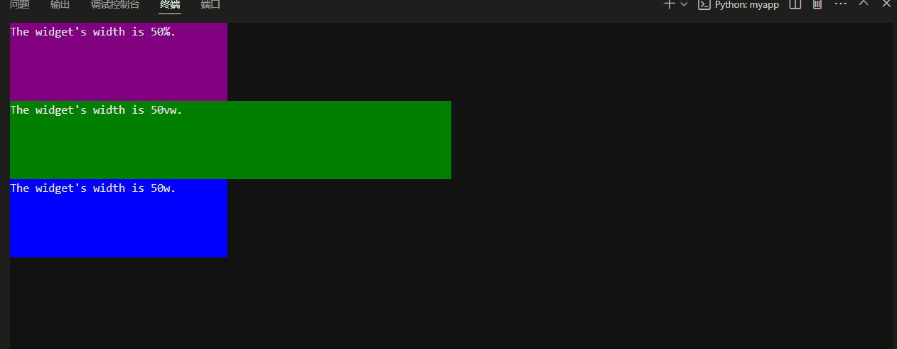

百分制的比例单位很好用，同时也带来另一个问题——如果想要让组件占据容器的三分之一，怎么写？

100的三分之一，是33.3333……好吧，想要完美的三分之一的话，几乎不可能，只能用精度比较高的小数实现，让近似值显示效果等同于三分之一。不过，还有一个单位可以完美实现此效果，那就是分数单位`fr`（即fraction），一个为解决三等分而生（也许不是）的单位。

想要完美使用分数单位，就要让使用该单位的组件在某一方向上完全占据容器。为什么要这样做呢？那就要从分数单位的特性说起。假定在一个方向上，有三个组件，每个组件的长度（对应实际就是宽度或者高度）都是1fr，那实际显示时，这个长度就会变成总长的三分之一。每个组件的长度是一份，总长是三份。实际上，分数单位的英文fr，就是单词fraction（分数）的意思。下面的代码正好展示了这个特性：

```python3
from textual.app import App
from textual.widgets import Static
from textual.containers import Container

class MyApp(App):
    def compose(self):
        self.widgets = [ Static() for _ in range(3) ]
        self.container = Container(*self.widgets)
        yield self.container

    def on_mount(self) -> None:
        self.container.styles.width = '50%'
        self.container.styles.height = 'auto'
        for widget in self.widgets:
            index = self.widgets.index(widget)
            widget.styles.width = 50
            widget.styles.background = ['purple','green','blue'][index]
            widget.styles.height = '1fr'
            widget.update('The widget\'s height is 1fr.')

if __name__ == '__main__':
    app = MyApp()
    app.run()
```

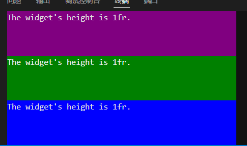

需要注意的是，读者在实际使用中可能会发现，上面几种比例单位的显示效果并不完美，应该是三分之一或者50%的组件，和同样宽高的组件差一点。这是因为终端显示单个字符必须是完整的最小宽高，不会做缩放也没法继续分割。组件的大小组成又是基于字符而来，因此，在调整终端大小的时候，会出现终端或者容器大小没法被整除，部分组件就会比同样数值的组件少一行或者一列。TUI程序受限于终端显示，这也是没有办法的。

上面用于宽度和高度的单位，也适用于组件的[最小宽度（min_width）](https://textual.textualize.io/styles/min_width/)、[最大宽度（max_width）](https://textual.textualize.io/styles/max_width/)、[最小高度（min_height）](https://textual.textualize.io/styles/min_height/)、[最大高度（max_height）](https://textual.textualize.io/styles/max_height/)。这几个属性用于设置终端大小变化时，组件显示大小的上下限。

##### 2.2.4.5 内边距

内边距（padding）是指组件边界距离内部内容的远近，完整的用法可以参考[官网文档](https://textual.textualize.io/styles/padding/)。

以下面的代码为例，将内边距设置为2之后，内容到上下左右边界的距离都是2个单位（字高或者字宽）：

```python3
from textual.app import App
from textual.widgets import Static

class MyApp(App):
    def compose(self):
        self.widget = Static()
        yield self.widget

    def on_mount(self) -> None:
        self.widget.styles.width = 30
        self.widget.styles.padding = 2
        self.widget.styles.background = 'purple'
        self.widget.update('The widget\'s padding is 2.')

if __name__ == '__main__':
    app = MyApp()
    app.run()
```

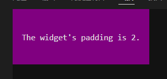

如果读者看过内边距的官网文档（实际上是样式手册），肯定很好奇，文档中写明内边距支持设置两个值或者四个值，使用样式接口实现的话，代码怎么写？

给没时间看文档的读者解释一下，上面的代码中，内边距只设置一个值，那么四个方向上的内边距就都用此值。如果想要单独定义某个方向的内边距，就要给内边距传递两个值或者四个值。两个值表示上下方向上的内边距使用第一个值，左右方向上的内边距使用第二个值；四个值表示上边的内边距使用第一个值，右边的内边距使用第二个值，下边的内边距使用第三个值，左边的内边距使用第四个值。

传递多个值给内边距，需要使用元组将多个值包起来，如`(1,2)`，具体见下面的代码示例：

```python3
from textual.app import App
from textual.widgets import Static

class MyApp(App):
    def compose(self):
        self.widget = Static()
        yield self.widget

    def on_mount(self) -> None:
        self.widget.styles.width = 30
        padding = (1,2) #上下为1，左右为2
        # (1,2,1,2)的话，就是对应上、右、下、左
        self.widget.styles.padding = padding
        self.widget.styles.background = 'purple'
        self.widget.update(f'The widget\'s padding is {padding}.')

if __name__ == '__main__':
    app = MyApp()
    app.run()
```

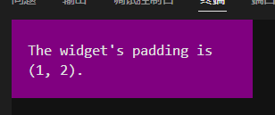

##### 2.2.4.6 边框

如盒子模型一节中的图片所示，边框（border）是包含在组件内、用于表示组件边界的突出性显示元素。想要设置边框的话，就要设置`styles.border`属性为一个描述边框样式、包含两个字符串的元组，如` ('heavy','yellow')`。元组的第一个元素是边框样式（更多样式参考[官网文档](https://textual.textualize.io/styles/border/#all-border-types)），元组的第二个元素是边框颜色，支持颜色名字、量化颜色表达（RGB颜色或者HSL颜色）。

不过，如果读者看了[官网文档](https://textual.textualize.io/styles/border/)，就会看到最上面介绍的用法，可能会有个疑问：页面里写着可以额外添加一个百分比数字来设置颜色透明度，但在样式接口没有这个用法，如何给样式接口中的颜色设置透明度？

接口不提供直接的方法，但可以用Alpha颜色代替，间接实现，即使用Color.parse可以识别的带透明度的颜色（RGBA颜色或者HSLA颜色），也可以直接用Color对象，构建时传入透明度信息。

一般的用法：

```python3
from textual.app import App
from textual.widgets import Static

class MyApp(App):
    def compose(self):
        self.widget = Static()
        yield self.widget

    def on_mount(self) -> None:
        self.widget.styles.width = 50
        border = ('heavy','yellow')
        self.widget.styles.border = border
        self.widget.styles.background = 'purple'
        self.widget.update(f'The widget\'s border is {border}.')

if __name__ == '__main__':
    app = MyApp()
    app.run()
```

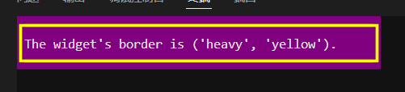

设置边框的透明度：

```python3
from textual.app import App
from textual.widgets import Static
from textual.color import Color

class MyApp(App):
    def compose(self):
        self.widget = Static()
        yield self.widget

    def on_mount(self) -> None:
        self.widget.styles.width = 50
        border = ('heavy',Color(255,255,0,a=0.5))
        self.widget.styles.border = border
        self.widget.styles.background = 'purple'
        self.widget.update(f'The widget\'s border is {border}.')

if __name__ == '__main__':
    app = MyApp()
    app.run()
```

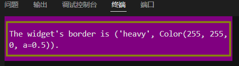

和内边距支持1个、2个、4个值类似，边框样式也支持一样的数量，并且概念相同。当值是2个时，第一个值设置的是上下边框的样式，第二个值设置的是左右边框的样式。当值是4个时，第一个值设置的是上边框的样式，第二个值设置的是右边框的样式，第三个值设置的是下边框的样式，第四个值设置的是左边框的样式。

给边框设置多个值，需要将样式元组放到列表里，如` [('heavy','yellow'),('heavy','blue')]`。

代码示例如下：

```python3
from textual.app import App
from textual.widgets import Static

class MyApp(App):
    def compose(self):
        self.widget = Static()
        yield self.widget

    def on_mount(self) -> None:
        self.widget.styles.width = 50
        border = [('heavy','yellow'),('heavy','blue')]
        # 2个表示上下、左右的样式，四个表示上、右、下、左的样式
        self.widget.styles.border = border
        self.widget.styles.background = 'purple'
        self.widget.update(f'The widget\'s border is {border}.')

if __name__ == '__main__':
    app = MyApp()
    app.run()
```

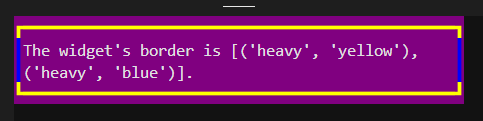

##### 2.2.3.7 边框标题和边框副标题的对齐方向

组件有两个和边框有关的属性，只有组件的边框显示时（边框的样式不为`'hidden'`或者`'none'`）才会显示，那就是边框标题（border_title）和边框副标题（border_subtitle）。边框标题显示在上边框上，默认在左边；设置了边框标题之后，边框就会变得和winform的分组框（GroupBox）一样，可以用来概述组件内的内容或者组件内其他组件的分类。边框副标题显示在下边框，默认在右边；边框副标题可以看作是显示在下边框上的边框标题，或者当作对边框标题的补充解释。

如果想修改边框标题或者边框副标题的对齐方向，就要设置样式接口中的边框标题对齐（border_title_align）或者边框副标题对齐（border_subtitle_align）。对齐方向支持`'left'`（向左）、`'center'`（居中）、`'right'`（向右）。

完整内容可以参考官网文档：

https://textual.textualize.io/styles/border_title_align/

https://textual.textualize.io/styles/border_subtitle_align/

下面的代码中，就是添加了边框标题和边框副标题之后，将边框标题设置为居中：

```python3
from textual.app import App
from textual.widgets import Static

class MyApp(App):
    def compose(self):
        self.widget = Static()
        yield self.widget

    def on_mount(self) -> None:
        self.widget.styles.width = 50
        border = ('heavy','yellow')
        self.widget.styles.border = border
        self.widget.styles.background = 'purple'
        self.widget.update(f'The widget\'s border is {border}.')
        self.widget.border_title = 'border_title'
        self.widget.border_subtitle = 'border_subtitle'
        self.widget.styles.border_title_align = 'center'

if __name__ == '__main__':
    app = MyApp()
    app.run()
```

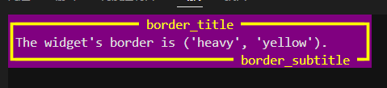

##### 2.2.4.8 轮廓

（先说轮廓和边框相同，然后卖个关子，说又有点不同，然后先展示代码和运行效果，再说轮廓的不同点，给个完美解决方法。）

轮廓（Outline）与边框用法相同，但是不属于组件尺寸的一部分，，不会让内部的内容重新排版，因此可能会与内容重叠

https://textual.textualize.io/styles/outline/


```python3
from textual.app import App
from textual.widgets import Static

class MyApp(App):
    def compose(self):
        self.widget = Static()
        yield self.widget

    def on_mount(self) -> None:
        self.widget.styles.width = 50
        outline = ('heavy','yellow')
        self.widget.styles.outline = outline
        self.widget.styles.background = 'purple'
        self.widget.update(
            f'''
The widget\'s outline is {outline}.
'''
        )

if __name__ == '__main__':
    app = MyApp()
    app.run()
```

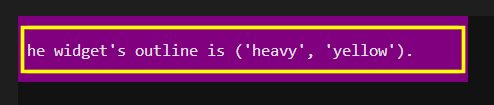


（说一下上面代码里和现实效果的奇怪之处，）

大纲对于强调小部件很有用，但请注意它可能会掩盖您的内容。最好设置一个内边距（用自己的话说一遍）


上面的怪异代码就可以变成和原来一样整齐的代码：

```python3
from textual.app import App
from textual.widgets import Static

class MyApp(App):
    def compose(self):
        self.widget = Static()
        yield self.widget

    def on_mount(self) -> None:
        self.widget.styles.width = 50
        outline = ('heavy','yellow')
        self.widget.styles.outline = outline
        self.widget.styles.background = 'purple'
        self.widget.styles.padding = 1
        self.widget.update(f'The widget\'s outline is {outline}.')

if __name__ == '__main__':
    app = MyApp()
    app.run()
```

##### 2.2.4.9 盒子尺寸类型

content-box

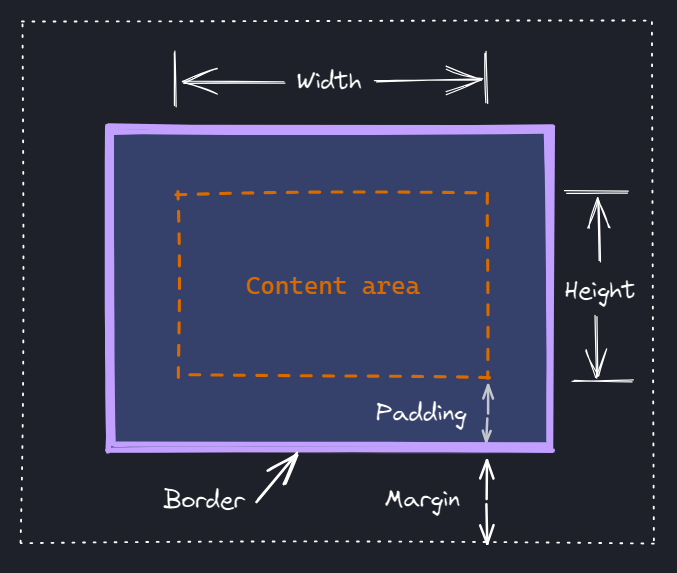

border-box

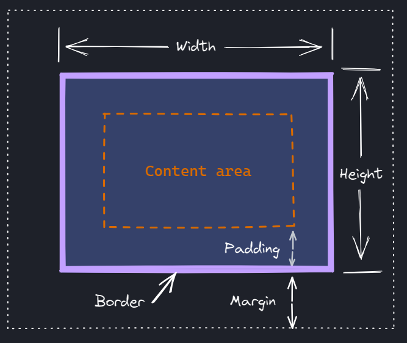

##### 2.2.4.10 外边距

https://textual.textualize.io/styles/margin/


##### 2.2.4.11 更多样式

（下面内容润色一下，主要是总结上面内容，并引出下一节textual的CSS，说明textual的CSS是更加强大（写在CSS中，不受限于Python接口，比如边框一节中就不支持颜色带上透明度百分比，只能用Alpha颜色）、全面的外观设计方法）

我们已经介绍了文本应用程序使用的最基本的样式，但您还可以使用更多样式来自定义应用程序外观的许多方面。请参阅样式参考以获取完整列表。

在下一节中，将介绍textual的CSS，这是一种将样式应用于小部件的强大方法，可以使您的代码不受样式属性的影响。

https://textual.textualize.io/styles/


#### 2.2.5 textual的CSS


https://textual.textualize.io/styles/

https://textual.textualize.io/css_types/


DOM查询


布局


事件与消息

https://textual.textualize.io/events/


输入


行动


组件

https://textual.textualize.io/widgets/

动画


屏幕


### 2.3 组件一览


## 3 高阶技巧

https://textual.textualize.io/reference/

https://textual.textualize.io/api/

### 3.1 高阶知识

开发者工具的console和log相关部分

​	run和serve的端口参数`--port`，同名不同义，修改serve命令调试端口的技巧

基本概念

​	退出

​		程序退出也有参数技巧，退出run循环之后，实际上还能执行代码，可以在run方法之后，接受textual程序的返回值，来判断程序是不是正常退出。

​	挂起

样式

​	颜色类（from textual.color import Color），Color.parse其实还可以转换ansi颜色，比如`Color.parse('ansi_red')`

```python3
ANSI_COLORS = [
    "black",
    "red",
    "green",
    "yellow",
    "blue",
    "magenta",
    "cyan",
    "white",
    "bright_black",
    "bright_red",
    "bright_green",
    "bright_yellow",
    "bright_blue",
    "bright_magenta",
    "bright_cyan",
    "bright_white",
]
```

​	特别的颜色：transparent

​	边框标题相关的其他样式：[`border-title-color`](https://textual.textualize.io/styles/border_subtitle_color/)、[`border-title-background`](https://textual.textualize.io/styles/border_subtitle_background/)、[`border-title-style`](https://textual.textualize.io/styles/border_subtitle_style/)、[`border-subtitle-color`](https://textual.textualize.io/styles/border_subtitle_color/)、[`border-subtitle-background`](https://textual.textualize.io/styles/border_subtitle_background/)、[`border-subtitle-style`](https://textual.textualize.io/styles/border_subtitle_style/)。

主题

反应性

worker

调色盘